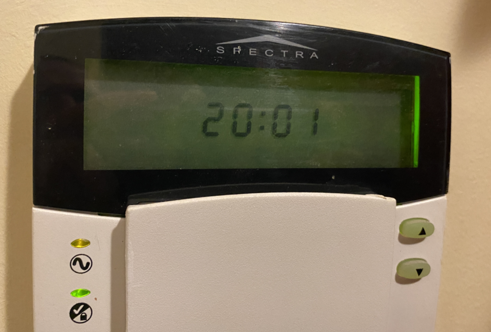
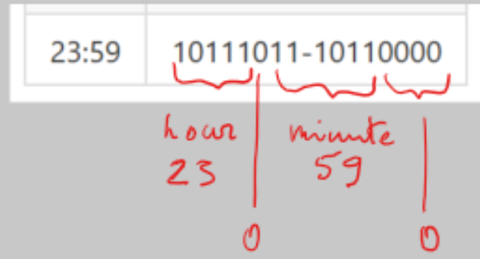
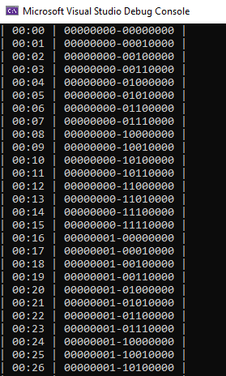

# Two Bytes Clock 24h
This two bytes clock is used by the Paradox Security systems.


### Two bytes for a clock

These two bytes has to be a clock but I didn't know how?

Byte1 : Byte2 = 0000 0000 : 0000 0000

### Algorithm

1. Byte2 is increasing in every minute by 16 bit. <br>
One way to show it is to use octal numeric system by adding 20 in every minute. (OCT) 00 20 40 60 100
2. When Byte2 reach it's maximum (OCT) 360 then one bit is added to Byte1. <br>
One bit is added into Byte1 in every 16 minute. One hour is: Byte1 increased by 3 bit and Byte2 increased by 176 bit.
3. Every hour the Byte1 will increase by 8 bit or by 10 (OCT). (OCT) 0h - 0; 1h - 10; 2h - 20; .. 8h - 100.

|Time|Byte1-Byte2|
|---|---|
| 00:00 | 00000000-00000000 |
| 00:01 | 00000000-00010000 |
| 00:02 | 00000000-00100000 |
| 00:03 | 00000000-00110000 |
|...|...|
| 00:15 | 00000000-11110000 |
| 00:16 | 00000001-00000000 |
| 00:17 | 00000001-00010000 |
|...|...|
| 00:31 | 00000001-11110000 |
| 00:32 | 00000010-00000000 |
| 00:33 | 00000010-00010000 |
|...|...|
| 00:47 | 00000010-11110000 |
| 00:48 | 00000011-00000000 |
| 00:49 | 00000011-00010000 |
|...|...|
| 00:58 | 00000011-10100000 |
| 00:59 | 00000011-10110000 |
| 01:00 | 00001000-00000000 |
| 01:01 | 00001000-00010000 |
| 01:02 | 00001000-00100000 |
|...|...|
| 23:59 | 10111011-10110000 |

### Two Solutions
There are two different solutions. 
1. Traditional shift-operation with binary numbers. 
2. Mathemathical calculation. This was an initial solution.

#### 1. Traditional binary shift operations
Look at the numbers in binary format. The clock is much simpler than it was at the beginning.
Look at these 2 bytes as an one 16 bit number.

* Bits 1-4 are always zeros.
* Bits 5-10 are minute.
* Bit 11 is zero.
* Bits 12-16 are hour.

|0000 |0000 | 0000 | 0000 |
|-|-|-|-|
|HHHH |H0mm | mmmm | 0000 |

Graphical view of this.



Getting hours and minutes by the traditional binary shift operations.
```c#
//getting minute and hour with shift operations
int tHour = Byte1 >> 3;
int tMinute = ((Byte1 & 3) << 4) + (Byte2 >> 4);
```
Another way is to create one 16 bit number and then shift the clock from that number.
```c#
//creating one 16 bit number and then reading clock from that number
int twoBytes = (Byte1 << 8) + Byte2;
int tHour = twoBytes >> 11;
int tMinute = (twoBytes & 0x3F0) >> 4;
```

#### 2. Mathemathical
Reverse engineering found that the clock was is easier to understand if using octal numeral system. 
Anyway, this is how I started. To understand all of the complexity I had to acquire the ability to calculate simultaneously in all four numeral systems.

To solve this mathemathical clock challenge the first task was to build the clock generator.

Octal numeric system? Huhh, crazy thing. 
Do you know what is Octal numeric system? The numbers are going up only to 7 and after that comes 10.
>Octal 0,1,2,3,4,5,6,7,10,11,12,13,14,15,16,17 ...

Some time examples:
* time 23:59 is in Octal 273 260 and in Hex 0xBB 0xB0.
* time 8:00 is in Octal 100 and in Hex 0x08.
* time 20:00 is in Otal 240 and in Hex 0xA0.

The final solution is a geniusly simple as it has just two lines of code (hours and minutes) with a little mathematics. 
This solution is giving exactly same output as the first solution (which is better). 

```c#
//getting minute and hour in mathemathical way
int hour = Byte1 / 8;
int minute = Byte1 % 8 * 16 + Byte2 / 16;
```

Output of this program.


## Thanks, Paradox

Thanks, Paradox for this challenge. Math is cool. Learn it and you will understand it.

This project is related directly with my Paradox Security System Spectra 1738 serial output reverse engineering project.</br>
https://github.com/LeivoSepp/Paradox-Spectra-1738-SerialOutput 

### Resources used during the project
Working with octal, byte, hex numbers.

These links were used to build the octal generator for a clock reverse engineering.</br>
https://stackoverflow.com/questions/34362859/add-two-octal-numbers-directly-without-converting-to-decimal </br>
https://stackoverflow.com/questions/3781764/how-can-we-convert-binary-number-into-its-octal-number-using-c </br>
https://docs.microsoft.com/en-us/dotnet/api/system.bitconverter.tostring?view=net-5.0 </br>
https://stackoverflow.com/questions/1139957/convert-integer-to-hexadecimal-and-back-again </br>
