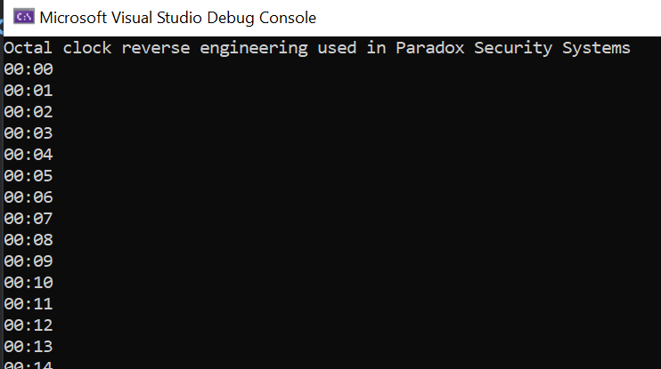

# Two Bytes Octal Clock 24h
This two bytes octal clock is used by the Paradox Security systems.

This project is related directly with my Paradox Security System Spectra 1738 serial output reverse engineering project.</br>
https://github.com/LeivoSepp/Paradox-Spectra-1738-SerialOutput </br>

Most difficult task was in this reverse engineering project to figure out how the clock is working. 
The outcome is completely useless as it reads just the time reported by Paradox panel (24h format). 
It is useless because after integration with another system the clock is managed anyway by Rasperry PI.
Still, this was a great mathemathical challenge to solve clock. 

When I started to build the clock generator I realized that it is based on octal numeric system. 
Huhh, crazy thing. Do you know what is Octal numeric system? The numbers are going up only to 7 and after that comes 10. 
>Octal 0,1,2,3,4,5,6,7,10,11,12,13,14,15,16,17 ...

Some time examples:
* time 23:59 is in Octal 273 260 and in Hex 0xBB 0xB0.
* time 8:00 is in Octal 100 and in Hex 0x08.
* time 20:00 is in Otal 240 and in Hex 0xA0.

The final solution is a genius as it has just two lines of code (hours and minutes) with little mathematics. </br>

```c#
int hour = msbDec / 8;
int minute = msbDec % 8 * 16 + lsb / 16;

TimeSpan time = new TimeSpan(hour, minute, 0);
DateTime dateTime = DateTime.Now.Date.Add(time);
Console.WriteLine($"{dateTime:t} ");
```
<p></p>



### Resources used during the project
Working with octal, byte, hex numbers.
These links were used to build the octal generator for a clock reverse engineering.</br>
https://stackoverflow.com/questions/34362859/add-two-octal-numbers-directly-without-converting-to-decimal </br>
https://stackoverflow.com/questions/3781764/how-can-we-convert-binary-number-into-its-octal-number-using-c </br>
https://docs.microsoft.com/en-us/dotnet/api/system.bitconverter.tostring?view=net-5.0 </br>
https://stackoverflow.com/questions/1139957/convert-integer-to-hexadecimal-and-back-again </br>
